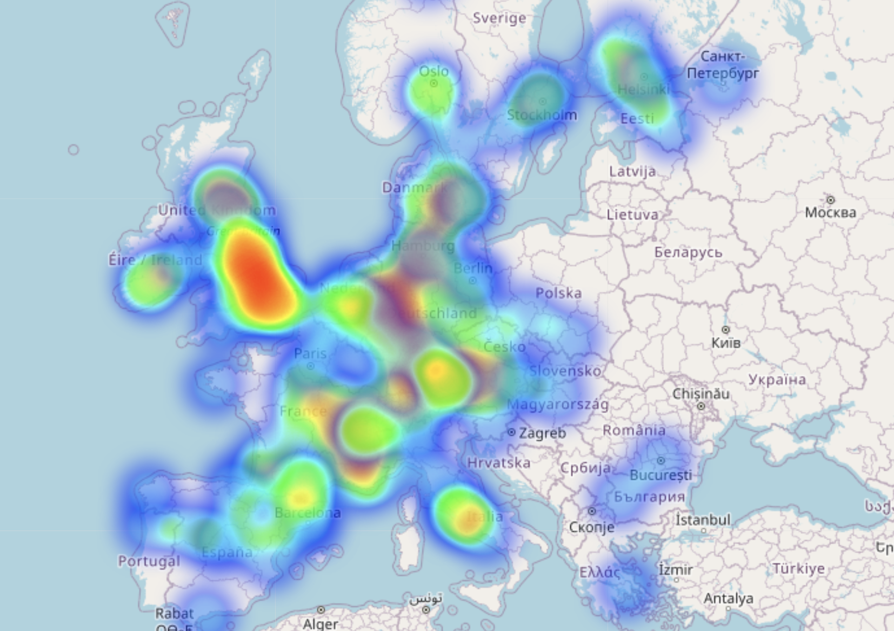
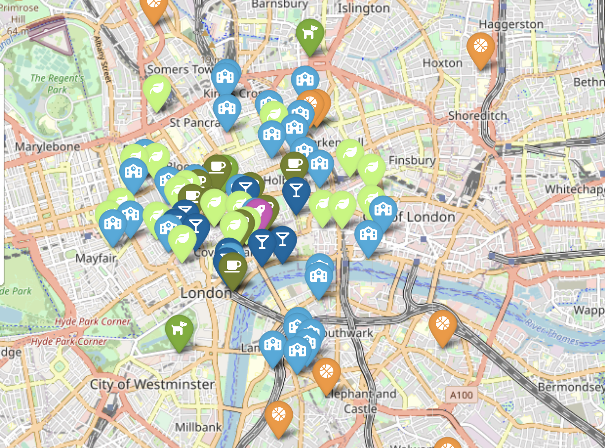

# Overview:
This project involves finding the best location for a new office for a company in the gaming industry by analyzing the employees' preferences. This task requires querying the database and using an API to obtain relevant data to determine the best location based on several criteria.

# Criteria:
The following criteria will be considered when determining the best location:

Designers like to go to design talks and share knowledge. 
30% of the company staff has at least 1 child.
Developers like to be near successful tech startups that have raised at least 1 Million dollars.
Executives like Starbucks a lot.
Account managers need to travel a lot.
Everyone in the company is between 25 and 40, give them some place to go party.
The CEO is vegan.
If you want to make the maintenance guy happy, a basketball stadium must be around 10 Km.
The office dog "Dobby" needs a hairdresser every month. Ensure there's one not too far away.

The study will search for a location that will meet all this criteria. 

# Code:
The code consists of several functions that query the database and use the API to obtain relevant data. It also involves visualizing the data using the Folium library.

To analyze the data, the tech_companies and design_companies are queried from the database to identify relevant companies in the tech and design industries. The get_offices_location function returns the location of offices for companies, which is used to create a heatmap. The heatmap is plotted on a world map, which visualizes the locations of companies in the tech and design industries. From the heatmap we can observe that London looks like it has the most companies in europe so the study will further investigate this city as a possible location for the office.

Firstly, the centroid of design companies and tech companies is found, afterwards we check if this location meets all the criteria. What we are sure of by now is that it will be close to design and tech companies.

Secondly, Foursquare helps the study to find nearby venues, including restaurants, schools, Starbucks locations, etc. We can observe that all the specified criteria is met in the chosen location. 
The followinng map shows the ideal location of the office marked with a rocket, and the surrounding venues. 

# Conclusion:
The GeoSpatial Data Project involves finding the best location for a new office for a company in the gaming industry by analyzing several criteria. The project involves querying the database, using an API to obtain relevant data, and visualizing the data using the Folium library. The project offers several options to determine the best location, including querying existing companies, comparing cities, and looking for venues close by. In the end, the study finds suitable (although surely expensive) location for the new office. 